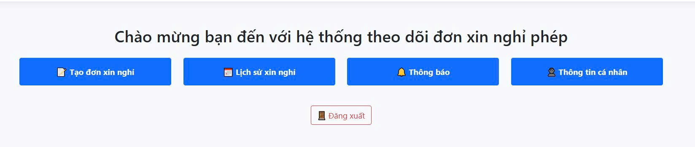

# NguyenDinhHuy-1771020357
# Hệ thống theo dõi đơn xin nghỉ phép trong công ty
# Chức năng:
    + Đăng nhập
    + Tạo đơn xin nghỉ và gửi cho admin kiểm duyệt
    + Lưu trữ dữ liệu về các đơn xin nghỉ đã duyệt thành công
  # Quản trị viên:
    + Danh sách đơn cần duyệt
    + Quản lý tài khoản nhân viên
    + Số dư ngày nghỉ phép
    + Đăng xuất
  # Nhân viên (người dùng):
    + Tạo đơn xin nghỉ phép
    + Lịch sử nghỉ phép
    + Thông báo từ quản trị viên
    + Thông tin cá nhân
# Giao diện:

  

  # Giao diện Quản trị viên:
  

    
    
    
    
  

  # Giao diện nhân viên:
  

    
    
    
    
    

# Database:

    

